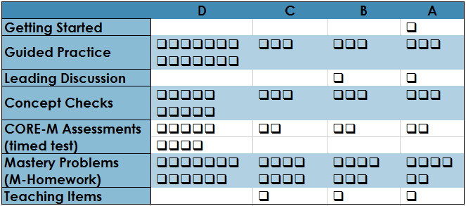
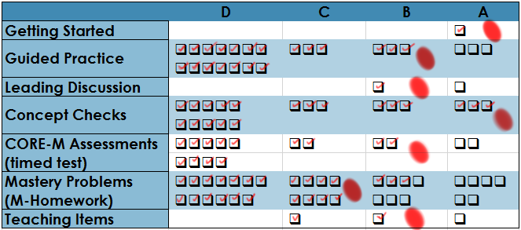
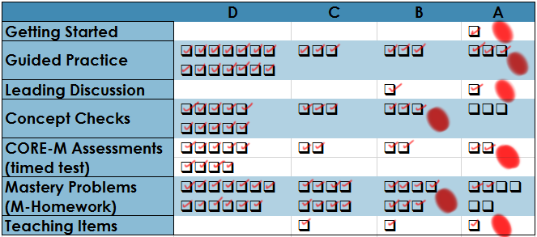

# Math 427 Syllabus

## Contact Information
__Instructor:__ Serge Ballif  
__Email:__ Please use the Piazza discussion board in the left panel of Canvas.  
__Telephone:__ (702) 992-2613  
__Office Hours:__ NSE 114 Mon/Wed/Fri 8:45-9:20, Tue/Thu 2:30-3:30 Drop by my office any time for help. 

## Ten Things you need to know about Math 453

1. I want you to be successful in the class. My job is to help you learn and develop a deep understanding of the course material. I am on your side! I would like our relationship to be like that between a client and a consultant who work together to achieve an end goal. Please feel free to come speak with me at any time. 
2. I expect you to be actively engaged in your learning. In order to learn mathematics, you have to do mathematics. In Math 453 you’ll be expected to work actively, and contribute to others’ work. There is very little lecture during class time; instead we’ll be solving puzzles and asking and answering questions.
3. You’re expected to spend significant time working on this class. For an upper level course, NSC expects a ratio of 3:1 of time spent outside class to time spent in class, so that’s about 9 hours a week of purposeful work outside of class for Math 453. You might need more, if your proof background is weak.
4. This is an advanced, proof-based, abstract subject. In this class we will study abstract ideas, and problem solving in abstraction is almost always done in the form of conjectures and proof. We will see computation and examples, but you won’t be able to use examples as “templates”. You will be writing proofs and lots of them.
5. Preparation for class and fluency with basic concepts before coming to class is essential for success. You’ll be expected to prepare for class by reading your textbook, doing basic exercises, and answering questions before we meet. If you don’t prepare for class, you won’t be able to participate in the in-class work and therefore you won't have the foundation for doing other work in the class. Take preparation seriously!
6. This course uses a points-free, competenc-based grading system. Each student chooses the grade he or she wants to earn in the course and then works through assignments to demonstrate the level of competency that grade requires. Your grade is based on demonstrated competency, not on the accumulation of points.
7. You will have opportunities to demonstrate mastery repeatedly on each objective throughout the semester. You will have the chance to revise many of the items you submit for assessment. In return, you are expected to master the concepts in those items and not just get things mostlyright.
8. Most work in this class is graded on a pass/no pass basis, so careful attention to the specifications for acceptable work is a must. Work in the class is marked on the basis of whether it passes a set of specifications for professionally acceptable work. It’s quite possible to earn Pass grades on every assessment item the first time, but this requires paying attention to your work and giving a strong effort to it.
9. Academic honesty is taken very seriously. We have simple and rigorously enforced policies in Math 453 to ensure that the work you are submitting is your own. All violations of these policies, no matter how seemingly small, have serious repercussions. Make it a goal to ask for help instead of bending the rules.
10. You may ask a question about anything at any time, especially in office hours. The material in this course is not necessarily easy, and at some point you will get stuck or frustrated. Don’t panic. Instead, seek out help. If you cannot make my office hours, you can always schedule an appointment and I will try to meet you. I won’t do your work for you, but I will help you ask the right kinds of questions that will help you get unstuck.

## Assigned Work
The work you do in the course has two purposes: To help you make sense of the concepts you are supposed to know, and to assess how well you have mastered the learning objectives of the course. These items of work include:

 

The object of the course for each student is to demonstrate mastery on as many learning objectives as possible.  

* __EDPuzzle:__ These are videos that you watch in preparation for class to accompany your reading of the textbook.
* __Daily Quizzes:__ At the beginning of each class period we will have a quiz to assess how well you have mastered the material of the previous.
* __WeBWorK Homework:__ There are 123 homework problems assigned on WeBWorK. Each problem gets unlimited attempts.   
* __Exam Questions__ Each section will have a corresponding problem on the exam.  
* __Teaching Items:__ Finally, to demonstrate mastery of core objectives students will be asked to create three lessons that show that they have mastered the material and are able to communicate it in a thorough and efficient way to an audience of their classmates. Students can complete one project of the types
  - __Texting Lesson__ Students can create a mock question-and-answer session where a teacher teaches the students one of the __CORE-M__ objectives of the class.
  - __Video Lesson__ The student will create a screencast video (or some other type of lesson video) summarizing one of the __CORE-M__ objectives of the class.
  - __Desmos Activity__ Students will create a Desmos account at https://teacher.desmos.com and create a lesson activity that illustrates one of the __CORE-M__ objectives of the class.

__Grading System__
Math 453 uses a **points-free mastery-based grading system** that is designed to provide you with control over the grading process, transparency as to your progress toward a course grade, and a final course grade that truly reflects your actual mastery of course  concepts. Our grading system works as follows:

* At the beginning of the semester, you will be asked to decide on the target grade you plan to earn for the course. This does not need to be an “A”. You’ll be asked to carefully consider your goals, skill set, life situation, academic needs, and so on before stating your target grade. For some students, a “B” or even a “C” is perfectly sufficient and realistic, relative to their situation.
* **The means of assessing your graded work in the class is done without using points**. Instead, your work is graded on a two-level scale of **Pass/No Pass** or on a three level scale of **Mastery/Progressing/Novice**. Whenever you submit work to be graded, I will employ my best professional judgment along with a clear list of specifications for categorizing that work. The specifications for your work are provided in a separate page, and you should make yourself intimately familiar with that page. Your EdPuzzle Videos, Daily Quizzes, and Exam Questions, are graded on a Pass/No Pass basis; Teaching Items are graded using Mastery/Progressing/Novice designations.
* The grade you earn at the end of the semester is determined by counting the number of items in each category that you complete at an acceptable level . There are no points involved and no statistical or numerical calculations.

The table for determining your grade is given below. For reference: there are a total of 22 Exam Problems, 22 Daily Quizzes, 26 EDPuzzle Videos, and 3 Teaching Items. “Pass” means the following:

+ For EDPuzzle, you receive a mark of __Pass__ if (and only if) each item you watch the video and answer the questions correctly. You might choose to watch the video multiple times so that you get the correct answer.
+ On Daily Quizzes you need to complete the problem with at most a cosmetic error to receive a mark of __Pass__. If you fail a particular quiz you can have a second attempt at it in my office with no penalty.
+ Exam Problems will be graded just like the Daily Quiz problems. Each exam problem type will show up on two exams during the semester.
+ Teaching Items are __Mastery Problems__ that will be graded on a three-level scale: Mastery/Progressing/Novice. A mark of __Mastery__ is reserved for a solution that meets the specifications for professionally acceptable work. A mark of __Progressing__ is for work that meets many of the specifications but has a small number of critical errors or otherwise fails to meet specifications but it’s close. __Novice__ is given to work that does not reach the level of Progressing.

 
## To earn an A

+ Complete the Getting Started assignment in week 1, AND
+ Pass 23 of 24 Guided Practice assignments, AND
+ Pass 2 of 3 Leading Discussions, AND
+ Pass 19 of 21 Concept Checks, AND
+ Pass 15 of 19 CORE-M problems on in-class assessments, AND
+ Attain Mastery level on 34 of 37 Mastery Problems on the homework, AND
+ Complete 3 Teaching Items (one of each type) with a Mastery level.

## To earn an B

+ Complete the Getting Started assignment in week 1, AND
+ Pass 20 of 24 Guided Practice assignments, AND
+ Pass 1 of 3 Leading Discussions, AND
+ Pass 16 of 21 Concept Checks, AND
+ Pass 13 of 19 CORE-M problems on in-class assessments, AND
+ Attain Mastery level on 28 of 37 Mastery Problems on the homework, AND
+ Complete 2 Teaching Items with a Mastery level.

## To earn an C

+ Complete the Getting Started assignment in week 1, AND
+ Pass 17 of 24 Guided Practice assignments, AND
+ Pass 13 of 21 Concept Checks, AND
+ Pass 11 of 19 CORE-M problems on in-class assessments, AND
+ Attain Mastery level on 21 of 37 Mastery Problems on the homework, AND
+ Complete 1 Teaching Item with a Mastery level.

## To earn an D

+ Complete the Getting Started assignment in week 1, AND
+ Pass 14 of 24 Guided Practice assignments, AND
+ Pass 10 of 21 Concept Checks, AND
+ Pass 9 of 19 CORE-M problems on in-class assessments, AND
+ Attain Mastery level on 13 of 37 Mastery Problems on the homework.
 
The table below shows the requirements necessary for each letter grade. To earn the grade listed in each row, a 
student must satisfy ALL the criteria in that row.

__Plus/Minus grading:__ In case not all of your attainments in the class are at the same grade level, we will figure plus/minus grades as follows. Note there are seven overall categories of work you will do: Getting Started, Guided Practice, Leading Discussions, Concept Checks, CORE-M Assessments, Mastery Problems, and Teaching Items.  First, find your category at which you have attained the lowest level of work. If that is the only category at this level, you will receive a “minus” grade for the next level up. If there are two categories at the lowest level you will receive a “plus” grade. Otherwise (more than two categories at that lowest level) you will receive the grade of your lowest level.

* Example : A student who has passed Getting Started, passed 20 Guided Practice assignments (B level), 19 Concept Checks (A level), passed 1 Leading Discussion (B level), passed 13 CORE-M Assessments (B level), attained mastery on 24 Mastery Problems (C level), and completed 2 Teaching Items at mastery level (B level) receives a B-- since the Mastery Problems was the lowest level but the only one at that level.

* Example : A student who has passed Getting Started, passed 23 Guided Practice assignments (A level), 16 Concept Checks (B level), passed 2 Leading Discussions (A level), passed 15 CORE-M Assessments (A level), attained mastery on 30 Mastery Problems (B level), and completed 3 Teaching Items at mastery level (A level) receives a B+ because the lowest level was a B, but there were only two categories with a score of B.

Please note that NSC does not award grades of A+ or D-.

_Note_: Guided Practice assignments may not be revised or submitted late. These must be completed at the stated deadline or they receive a permanent No Pass.

__Tokens:__ Each student will be given five “tokens” at the beginning of the term. Each token can be cashed in for one of the following:  

* A revision of a Mastery Problem that was assessed at Progressing level.
* A third attempt of a Concept Check.
* A 24-hour extension on any Mastery Problem  or Teaching Item due date, or the Getting Started assignment. If you choose to use a token for a deadline extension, you must inform me prior to the original deadline. Submissions given after the extended deadline are not accepted.  

Opportunities to earn additional tokens may be given during the semester.

__Notes about this grading system:__ The advantages of this grading system are numerous:

* It focuses course work away from point-scoring, which is counterproductive to learning, and focuses instead on whether or not your work meets professional quality standards.
* It places control of your grade firmly in your hands so that you don’t have to “hope” for a grade.
* It directly links the grade you earn to the amount and quality of work that you do.
* It gives a final grade that communicates real information about your mastery of the subject.
* Finally, it allows you to be graded on what you eventually master, so that early missteps do not have to have a major negative future impact.
 
The chief downside to this system is that it’s complicated. You can download my [sample gradebook](homework/Math453Gradebook.xlsx) to track your progress through the course to help make it easier. And if you have any questions or concerns about the system, please let me know.

## What are the consequences of missing class?

If you miss class you will miss out on the Concept Check quiz. The quiz will only be given to students in class; you will need to use one of your tokens if you want to take a quiz outside of class. If you miss class, then you will also miss out on the lecture and activities. One possible way to catch up on the material that was covered during class is to watch the lecture recording which can be accessed by clicking on the mediasite tab in Canvas. However, you should only think of the recorded lecture as a backup because there are occasionally technical problems.

Note that the style of this class is a partially flipped class, so you will do much of your learning by reading and watching videos outside of class. Much of each class period will be devoted to applying the principles and practicing the techniques that will be acquired in the out-of-class reading. You probably don’t want to miss out on the classroom discussion and activities. If you must miss class, then be sure to complete the Guided Practice prior to class.
